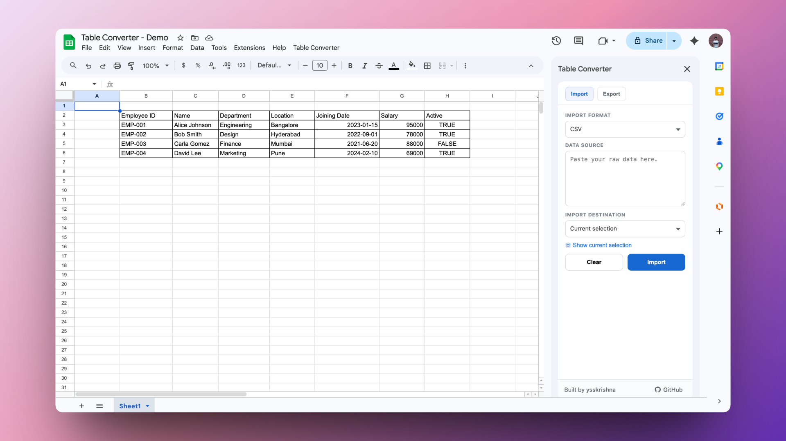
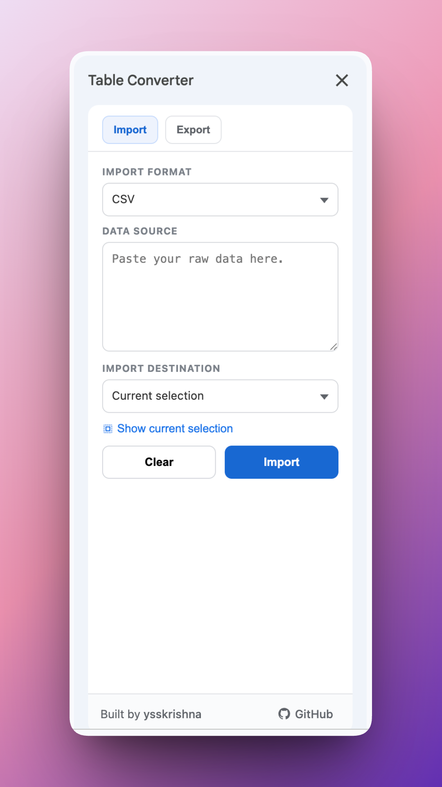
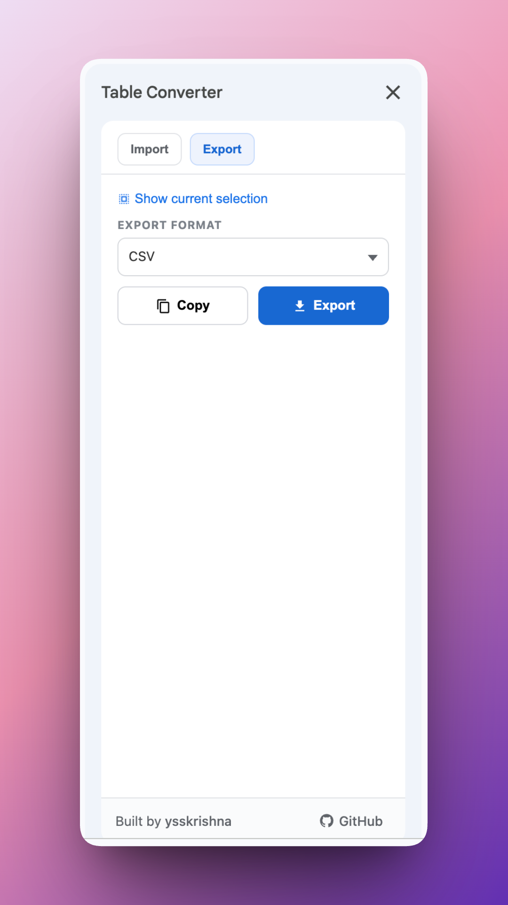

# Table Converter

    

Google Sheets add-on for importing and exporting table data as CSV, HTML, Markdown, and JSON

## Features
- **Import table data** - paste CSV, JSON Array, Markdown Table, or HTML Table and write to Sheets.
- **Export selected range** - convert the current selection to CSV, JSON, Markdown, or HTML.
- **Flexible import destination** - insert at current selection or create a new sheet automatically.
- **Copy or download export output** - one-click copy to clipboard or export as a file.

## Links

- **Documentation**: [https://ysskrishna.github.io/google-sheets-table-converter/](https://ysskrishna.github.io/google-sheets-table-converter/)
- **Changelog**: [https://ysskrishna.github.io/google-sheets-table-converter/changelog.html](https://ysskrishna.github.io/google-sheets-table-converter/changelog.html)
- **Terms of Service**: [https://ysskrishna.github.io/google-sheets-table-converter/terms.html](https://ysskrishna.github.io/google-sheets-table-converter/terms.html)
- **Privacy Policy**: [https://ysskrishna.github.io/google-sheets-table-converter/privacy.html](https://ysskrishna.github.io/google-sheets-table-converter/privacy.html)
- **Support**: [https://ysskrishna.github.io/google-sheets-table-converter/support.html](https://ysskrishna.github.io/google-sheets-table-converter/support.html)

## Screenshots

## Author

Built and maintained by **Y. Siva Sai Krishna**.

[Author's GitHub](https://github.com/ysskrishna) • [Author's LinkedIn](https://www.linkedin.com/in/ysskrishna) • [Add to Google Sheets](https://workspace.google.com/marketplace/app/table_converter/489677791287) • [Documentation](https://ysskrishna.github.io/google-sheets-table-converter/) • [Product page](https://www.ysskrishna.space/products/58-google-sheets-table-converter) • [More Google Workspace add-ons](https://www.ysskrishna.space/products?category=google-workspace-add-ons) • [Table Converter blog](https://www.ysskrishna.space/blog/tag/google-sheets-table-converter)
