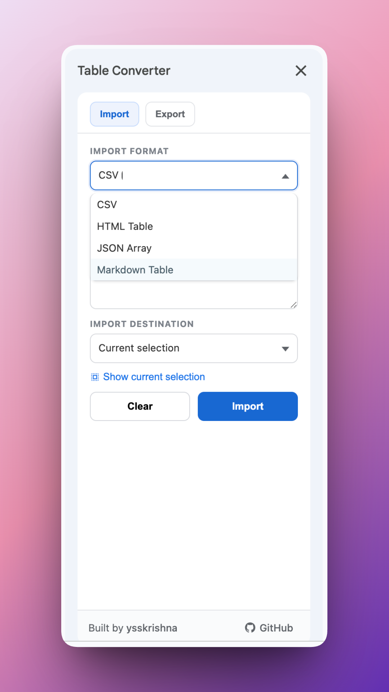

# Table Converter

Google Sheets add-on for importing and exporting table data as CSV, HTML, Markdown, and JSON

## Features

- **Export** — write the current selection or sheet to CSV, HTML, Markdown, or JSON
- **Import** — paste or load structured text and apply it as values in the spreadsheet
- **Works in-place** — uses the spreadsheet you already have open

## Links

- **Home**: https://ysskrishna.github.io/google-sheets-table-converter/
- **Changelog**: https://ysskrishna.github.io/google-sheets-table-converter/changelog.html
- **Terms of Service**: https://ysskrishna.github.io/google-sheets-table-converter/terms.html
- **Privacy Policy**: https://ysskrishna.github.io/google-sheets-table-converter/privacy.html
- **Support**: https://ysskrishna.github.io/google-sheets-table-converter/support.html

## Screenshots

## Author

Built and maintained by **Y. Siva Sai Krishna**.

[Author's GitHub](https://github.com/ysskrishna) • [Author's LinkedIn](https://www.linkedin.com/in/ysskrishna)
